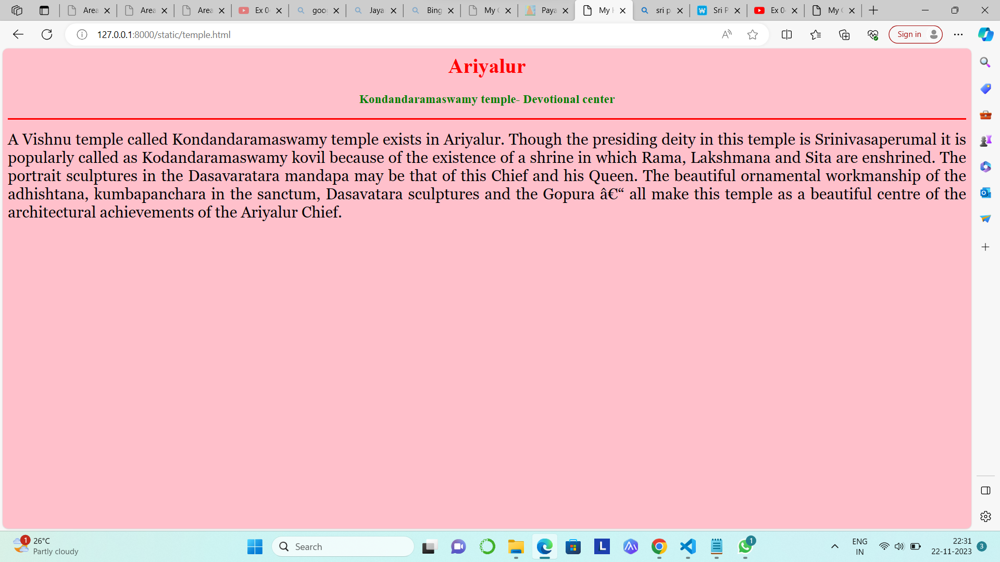

# Ex04 Places Around Me
## Date: 22.11.2023

## AIM
To develop a website to display details about the places around my house.

## DESIGN STEPS

### STEP 1
Create a Django admin interface.

### STEP 2
Download your city map from Google.

### STEP 3
Using ```<map>``` tag name the map.

### STEP 4
Create clickable regions in the image using ```<area>``` tag.

### STEP 5
Write HTML programs for all the regions identified.

### STEP 6
Execute the programs and publish them.

## CODE
```
map.html
<html>
<head>
<title>My City</title>
</head>
<body>
<h1 align="center">
<font color="purple"><b>ARIYALUR - MY CITY</b></font>
</h1>
<h3 align="center">
<font color="green"><b>ATCHAYA K (23014009)</b></font>
</h3>
<center>

<map name="MyCity">
<area shape="rect" coords="920,140,1190,215" href="home.html" title="My Home Town">
<area shape="rect" coords="1050,25,1177,65" href="mahal.html" title="Subramaniyar Mahal">
<area shape="rect" coords="1300,170,1600,235" href="tourist.html" title="Gangaikondacholapuram">
<area shape="rect" coords="615,215,850,250" href="sanctuary.html" title="Sri payaraneeswarar temple">
<area shape="rect" coords="10,435,100,400" href="temple.html" title="Kondandaramaswamy temple">
</map>
</center>
</body>
</html>

home.html


<html>
<head>
<title>My Home Town</title>
</head>
<body bgcolor="yellow">
<h1 align="center">
<font color="red"><b>Ariyalur</b></font>
</h1>
<h3 align="center">
<font color="green"><b>Jayankondam - My Home Town</b></font>
</h3>
<hr size="3" color="red">
<p align="justify">
<font face="Georgia" size="5">
Jayankondam is one of the most important places for the Chozha Dynasty.it is in Ariyalur district.The district is bordered by the districts of Cuddalore to the north and north-east, Mayiladuthurai to the east, Thanjavur to the south and south-east, Tiruchirapalli to the south-west and Perambalur to the west.
Gangaikonda Cholapuram,is a unesco World Heritage Site situated in this district. 
The district is also known for its rich prehistoric fossils.There are undiscovered yet beautiful places to visit in this district.
Some of them are the famous gangaikondacholapuram temple,karaivetti bird sanctuary,Kondandaramaswamy temple ,several cement factory and so on .

</font>
</p>
</body>
</html>

mahal.html

<html>
<head>
<title>My Home Town</title>
</head>
<body bgcolor="cyan">
<h1 align="center">
<font color="red"><b>Ariyalur</b></font>
</h1>
<h3 align="center">
<font color="green"><b>Subramaniyar Mahal - Marriage Hall</b></font>
</h3>
<hr size="3" color="red">
<p align="justify">
<font face="Georgia" size="5">
Subramaniyar Mahal is a marriage hall where marriage ceremonies are held.Typically,a marriage hall is where parties and marriages are
handled and conducted.This Mahal is a special purpose room or a building used for hosting large social and business events.Typically a
marriage hall is capable of serving dozens to hundreds of people a meal in a timely fashion.
</font>
</p>
</body>
</html

tourist.html

<html>
<head>
<title>My Home Town</title>
</head>
<body bgcolor="peach">
<h1 align="center">
<font color="red"><b>Ariyalur</b></font>
</h1>
<h3 align="center">
<font color="green"><b>Gangaikondacholapuram - A tourist spot</b></font>
</h3>
<hr size="3" color="red">
<p align="justify">
<font face="Georgia" size="5">
Gangaikonda Cholapuram,is a unesco World Heritage Site situated in ariyalur district.This temple is a living history of the Cholas in stone from the period of Rajendra-I and a beautiful gallery of Chola art and architecture.
One of the largest temples in India, the Gangaikonda Cholapuram temple has Shiva as the principal deity.
 The main temple tower stands 55 m tall and the imposing building is covered in rich art and sculptures that adorn the premises in absolute grandeur. 
 The magnificent temple is built on an elevated structure.Its a well-known unesco tourist spot.
</font>
</p>
</body>
</html>

sanctuary.html

<html>
<head>
<title>My Home Town</title>
</head>
<body bgcolor="peach">
<h1 align="center">
<font color="red"><b>Ariyalur</b></font>
</h1>
<h3 align="center">
<font color="green"><b>Gangaikondacholapuram - A tourist spot</b></font>
</h3>
<hr size="3" color="red">
<p align="justify">
<font face="Georgia" size="5">
Gangaikonda Cholapuram,is a unesco World Heritage Site situated in ariyalur district.This temple is a living history of the Cholas in stone from the period of Rajendra-I and a beautiful gallery of Chola art and architecture.
One of the largest temples in India, the Gangaikonda Cholapuram temple has Shiva as the principal deity.
 The main temple tower stands 55 m tall and the imposing building is covered in rich art and sculptures that adorn the premises in absolute grandeur. 
 The magnificent temple is built on an elevated structure.Its a well-known unesco tourist spot.
</font>
</p>
</body>
</html>

temple.html

<html>
<head>
<title>My Home Town</title>
</head>
<body bgcolor="pink">
<h1 align="center">
<font color="red"><b>Ariyalur</b></font>
</h1>
<h3 align="center">
<font color="green"><b>Kondandaramaswamy temple- Devotional center</b></font>
</h3>
<hr size="3" color="red">
<p align="justify">
<font face="Georgia" size="5">
A Vishnu temple called Kondandaramaswamy temple exists in Ariyalur. 
Though the presiding deity in this temple is Srinivasaperumal it is popularly called as Kodandaramaswamy kovil because of the existence of a shrine in which Rama, Lakshmana and Sita are enshrined. The portrait sculptures in
 the Dasavaratara mandapa may be that of this Chief and his Queen. The beautiful ornamental workmanship of the adhishtana, kumbapanchara in the sanctum, Dasavatara sculptures and the Gopura – all make this temple as a beautiful centre of the architectural achievements of the Ariyalur Chief.
</font>
</p>
</body>
</html>
```


## OUTPUT





## RESULT
The program for implementing image maps using HTML is executed successfully.
